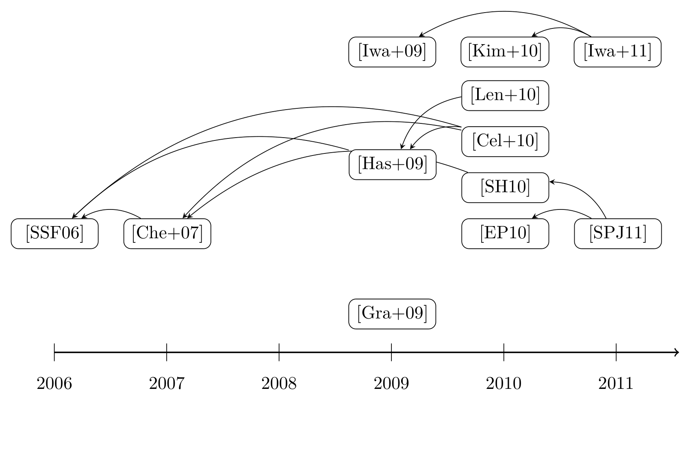
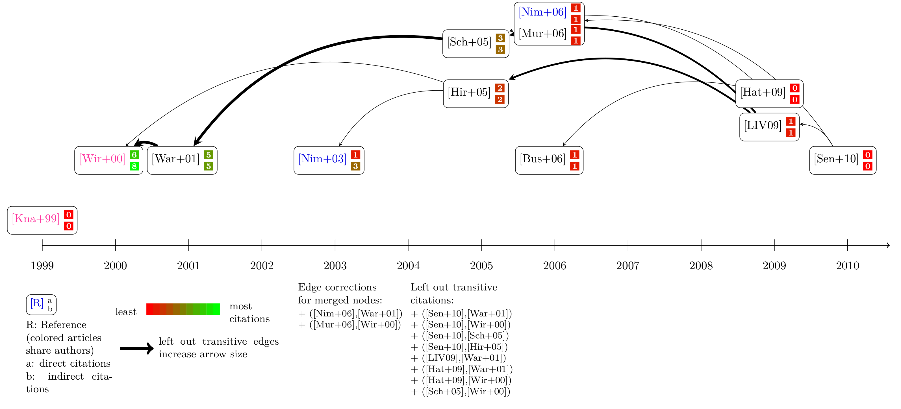

# ReviewVisualisation (ReViz)

ReViz is a tool for generating visualisations in systematic literature reviews (SLRs). Using this tool, two kinds of visualisations can be generated from review metadata. On the one hand, a flow diagram that illustrates the selection process of the contributions considered for inclusion can be obtained. On the other hand, the citations between the included articles can be depicted using a citation graph, enabling possibilities for further in-depth analyses.

Please cite our papers about ReViz whenever you use ReViz to generate citation graphs and add these citation graphs to your scientific papers and other publications:

**Sven Groppe, Lina Hartung, ReViz: A Tool for Automatically Generating Citation Graphs and Variants, International Conference on Asian Digital Libraries (ICADL): Digital Libraries at Times of Massive Societal Transition, online, https://doi.org/10.1007/978-3-030-64452-9_10**

BibTex Code of our ICADL'20 paper:

    @inproceedings{Groppe2020ReViz,
      title = {ReViz: A Tool for Automatically Generating Citation Graphs and Variants},
      author = {Sven Groppe and Lina Hartung},
      booktitle = {International Conference on Asian Digital Libraries (ICADL): Digital Libraries at Times of Massive Societal Transition},
      year = {2020},
      note = {online},
      url = {https://doi.org/10.1007/978-3-030-64452-9_10}
    }

**Sven Groppe, Lina Hartung, ReViz: Automatically Generating Citation Graphs (and Variants) for Systematic Reviews, Open Journal of Information Systems (OJIS) 8(1): 1--25, https://www.ronpub.com/ojis/OJIS_2021v8i1n01_Groppe.html**

BibTex Code of our OJIS paper:

    @article{Groppe2021Automatically,
      title = {Automatically Generating Citation Graphs (and Variants) for Systematic Reviews},
      author = {Sven Groppe and Lina Hartung},
      journal = {Open Journal of Information Systems (OJIS)},
      volume = {8},
      number = {1},
      pages = {1--25},
      publisher = {RonPub},
      year = {2021},
      url = {https://www.ronpub.com/ojis/OJIS_2021v8i1n01_Groppe.html}
    }

Examples of citation graphs generated by ReViz are:

There are a lot of features (node summaries, removing transitive edges, number of (in-) direct citations in node labels and coloring publications with common authors) to generate variants of the citaion graph. The following picture contains an example with all features of ReViz switched on:

To generate the graphics two kinds of input data are allowed. One is a bibtex-file with all included articles for the citations graph. Using this input, it is also possible to generate citation graphs without conducting a review. However, for the generation of a flow diagram it is mandatory to use the other input: a json-export from [this fork of Parsifal](https://github.com/l-hartung/parsifal), a tool to support systematic reviews.

## Installation

The easiest way to run ReViz is using docker containers. Please follow the [instructions](https://docs.docker.com/) to install docker and docker-compose on your machine. 

When docker is installed, you can copy the [docker-compose.yml](https://raw.githubusercontent.com/l-hartung/reviz/master/docker-compose.yml) to an empty folder anywhere on your machine. In this folder you should put any pdf, json or bib files you need because docker only gets access to directories on your host machine that you explicitly share with it. Using the default settings in the `docker-compose.yml`, the folder you downloaded this file to will be mapped into the docker containers. 

Next, pull the required images to your container runtime by opening a terminal to the respective folder and execute:

    docker-compose pull

This will pull the images for ReViz, Parsifal (tool for supporting SLRs) and Grobid (reference extraction for the citation graph). 

### Parsifal

Parsifal is a web based tool to support the review process. Its code is publicly available at https://github.com/vitorfs/parsifal. Because this version does not support machine readable data export, a fork is provided at https://github.com/l-hartung/parsifal which is able to extract the data as a json file. If you don't plan on conducting an SLR, Parsifal is not needed and you can comment out or remove the dependence of ReViz on Parsifal in the `docker-compose.yml`. 

Otherwise you should set up the database for Parsifal by running:

    docker-compose run --service-ports parsifal

This will create a folder named parsifal-db in your working directory and run the SQL statements to initialize the database. This may take a while, but afterwards you should be able to use Parsifal by visiting http://localhost:8000. If you run an older version of docker (for example using Windows 7, 8 or older builds of Windows 10), you have to change the address to the IP address of the linux virtual machine. You can find out what this value is using:

    docker-machine ip

Some important notes on security: The Parsifal container should *not* be exposed to the internet. It is using an insecure and slow web server, runs using Django's debug mode, connects to a slow SQLite database and uses a shared `SECRET_KEY` in the `docker-compose.yml`. These choices were made for the sake of simplicity and should still allow for sharing the instance within a network that you control.

### Running ReViz

To run ReViz, use commands in the form:

    docker-compose run --service-ports reviz <parameters>

You can access the help using:

    docker-compose run --service-ports reviz --help

    usage: reviz.py [-h] [--bib-file BIB_FILE] [--pdf PDF] [--tei TEI] [--tex TEX]
                    [--bibliography] [--deviation DEVIATION] [--transitivities]
                    [--transitivities-bold] [--citation-counts]
                    [--authors-colored]
                    {bib2json,grobid,flow,graph-model,draw,draw-summary} json

    positional arguments:
    {bib2json,grobid,flow,graph-model,draw,draw-summary}
                            (1) bib2json: convert bib-file with included publications
                              to required format, required if not using
                              parsifal export 
                            (2) grobid: gather citations from included papers 
                              using grobid 
                            (3) graph-model: generate json model for the citation 
                              graph with nodes and edges
                            (4) draw: generate pdf of citation graph 
                            (5) draw-summary: include optimalisations for the 
                              citation graph 
                            (6) flow: generate flow diagram, only possible if using
                              parsifal export
    json                    path for json-file

    optional arguments:
    -h, --help            show this help message and exit
    --bib-file BIB_FILE   path for input bib-file, will be written to parameter
                            'json'
    --pdf PDF             destination folder for pdf-files, default: ./pdf-files
    --tei TEI             destination folder for tei-files, default: ./tei-files
    --tex TEX             destination folder for generated tex-files, default: ./tex-files
    --bibliography        generation of a pdf bibliography for the citation
                            graph
    --deviation DEVIATION
                          maximum number of edge deviations allowed for node
                            summarization, default=0
    --transitivities      reduce number of edges by considering transitivities
    --transitivities-bold
                          adapt line width of transitive edges
    --citation-counts     show number of direct and indirect citations for every
                            node
    --authors-colored AUTHORS-COLORED
                          threshold for showing publications with same authors using 
                            colors, use a value between 0 and 1
    --with-single-nodes   nodes without any edge are displayed in the graph
    --minimum-citations   nodes below the given minimum number of citations are left out (Default=0, i.e. all nodes are displayed) 
	--without-dummy-nodes
                          avoid dummy nodes for better placement of nodes for long edges
    --dont-show-edge-corrections
                          do not show the list of edge corrections
    --original-bibtex-keys
                          the original bibtex keys are used instead of md5 hashes
    --without-interactive-queries
                          with this option you are not asked for manual confirmation if our algorithm is not completely certain that a citation match was found
    
Using the first positional argument, you can select which processing step should be carried out. 

#### `bib2json`

This step is only required if you are not using Parsifal. It converts a bibtex file to the format required for the following steps. For every article in the citation graph, you have to add either a direct link to the open access pdf or a path (relative to the folder you share with docker) to a file you already downloaded. This information has to be added in the `note` field of the entry:

    @article{citation_key,
      title={Example title},
      author={Example author},
      year={2019},
      note={pdf-files/example_title.pdf}
    }

Use the command like:

    docker-compose run --service-ports reviz bib2json --bib-file=<library.bib> <output.json>

#### `grobid` 

Using either the json file you downloaded from Parsifal or the output of the previous command, this step will send every provided pdf to the Grobid instance on your machine. When using Parsifal, you have to provide an URL or path to the pdf in the same way as above. For every imported article in Parsifal, you can add this path in the _Note_ field of the _Article Details_ which opens upon a click on the entry in the _Study Selection_ tab.

Call the command with:

    docker-compose run --service-ports reviz grobid <export.json> [--tei=<tei-folder>] [--pdf=<pdf-folder>]

The optional argument `--tei` states where the output tei files from Grobid should be written to. If the folder (default `./tei-files`) does not already exist, it will be created. The optional argument `--pdf` determines where files that are automatically downloaded from the URL you supplied are written to.

Processing with Grobid may take a while and may crash if you are using a virtual machine to run docker (Windows 7, 8, older versions of 10 or older versions of macOS) if not enough memory is provided. Details are available in the [grobid documentation](https://grobid.readthedocs.io/en/latest/Grobid-docker/). It is recommended to change the memory allocated to the virtual machine `default` to at least 3GB using VirtualBox.

#### `graph-model`

In this step, the references extracted using Grobid will be compared with all included articles in order to find edges for the citation graph:

    docker-compose run --service-ports reviz graph-model <export.json> [--tei=<tei-folder>] [--tex=<tex-folder>]

Use the same value for `--tei` as in the previous step. Once completed, the output will be written into `<tex-folder>/graph-model.json`.

By using the option `--original-bibtex-keys` the original bibtex keys remain, otherwise they are replaced with md5 hashes. The md5 hashes have a fixed length and hence are very good for displaying, but if you like to use the original bibtex file you may choose this option. 

You may be asked for manual confirmation if the algorithm is not completely certain that a match was found. By using the option `--without-interactive-queries` ReViz does not ask for an interactive manual confirmation and assumes no citation matches in theses cases. 

If you find that edges are missing from what you expect, you can add this information in `graph-model.json` by adding a new entry to the list `edges`. The entry must be a dictionary with keys `from` and `to` for the citing and cited node respectively. The values must be the keys from the according entry in the list `articles`.

#### `draw` and `draw-summary`

Here, the graph-model generated in the previous step is used to render the citation graph itself:

    docker-compose run --service-ports reviz draw <export.json> [--tex=<tex-folder>]

This will generate a LaTeX file in `<tex-folder>` from `<tex-folder>/graph-model.json`. Afterwards, it will automatically compile this tex file to pdf. TeXlive is included in the provided container for this purpose. However, you may copy the tex-files to include them into your latex-manuscript directly. The generated latex-file can be also compiled with pdflatex. 

The output from this command might be hard to read depending on the number of included publications and the citations between them. Hence, a number of measures are available to reduce the complexity of the graph or add further information. Use the following command to access them:

    docker-compose run --service-ports reviz draw-summary <export.json> [--tex=<tex-folder>] [...]

You can choose the following options:

* `--deviation=<number>` The call `draw-summary` will automatically join nodes with same incoming and outgoing edges. With this parameter, you can allow deviations between edges of merged nodes greater than zero. The greater this value, the more articles will be merged, but more edges will be inaccurate in the graph.
* `--transitivities` If an article A cites B and C, and article B also cites C, the edge from A to C is removed with this parameter, because the overall information flow from C to A is still evident via B. This will lead to a graph with less edges that span multiple years, increasing readability.
* `--transitivities-bold` By removing transitive edges the number of incoming edges is no longer correlated to the importance of a node. Hence, the line width of remaining incoming edges will be increased proportionally to the number of left out transitive edges with this parameter.
* `--citation-counts` Shows the true number of direct and indirect citations for every node. Additionally, the numbers are also mapped to a color gradient, which further illustrates these values.
* `--authors-colored=<number between 0 and 1>` If provided, this will highlight publications with shared authors. A high threshold close to 1 will only mark publications with very similar authors. Identical first authors are valued higher than others. 
* `--with-single-nodes` If provided, then nodes that are neither cited nor citing other nodes are left out. 
* `--minimum-citations` Nodes below the given minimum number of citations are left out (Default=0, i.e. all nodes are displayed). 
* `--without-dummy-nodes` If provided, then dummy nodes for better placement of nodes for long edges are avoided saving space in the citation graph
* `--dont-show-edge-corrections` If provided, the list of edge corrections are left out

For the `draw` and `draw-summary` calls, you can also add a flag `--bibliography` which will format a bibliography for the included publications of the citation graph with BibLaTeX.

#### `flow`

If you are using a Parsifal export, you can also generate a flow diagram of the review's article selection process:

    docker-compose run --service-ports reviz flow <export.json> [--tex=<tex-folder>]

The resulting pdf will be written to `<tex-folder>/flow.pdf`.
